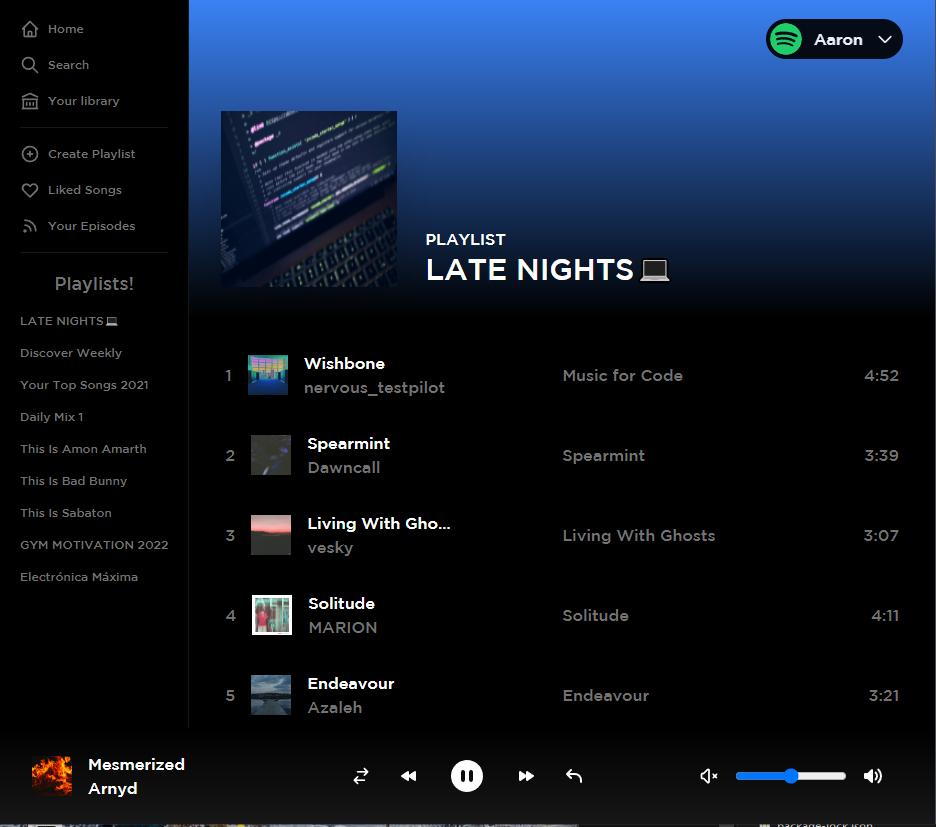
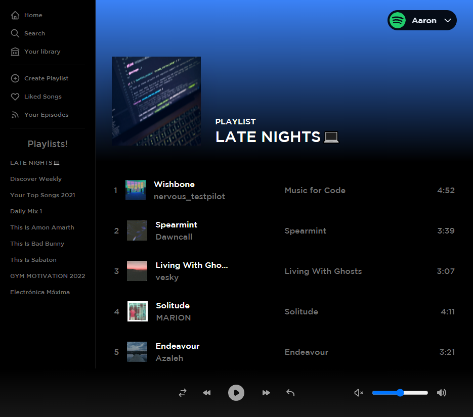

# Next.js + Tailwind CSS Example

Spotify front end using Nuxt.js & Tailwind

## Preview

<center></center>
<center></center>
<center></center>
<center></center>

## How to use

```bash
yarn
yarn dev
```

.env

```
NEXTAUTH_URL=http://localhost:3000/
NEXTAUTH_SECRET=
SPOTIFY_ID=
SPOTIFY_SECRET=
```
